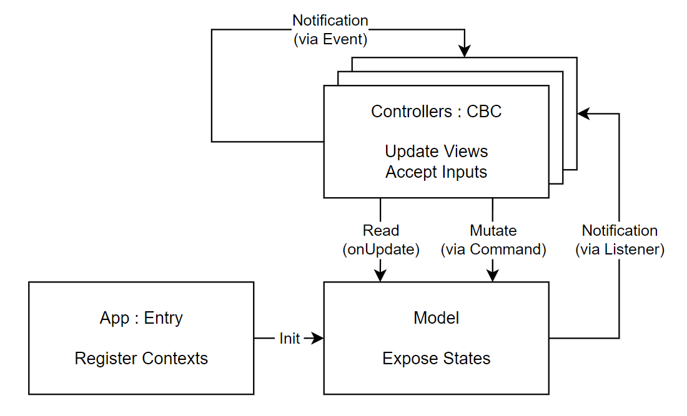

# UniStart


An experimental Unity3D framework which can boost your development speed several times over.

_Progressive, responsive, decoupled, and functional._

## Architecture Overview



## Installation

Add package from git URL:

```
https://github.com/DiscreteTom/UniStart.git
```

Include this package:

```cs
using DT.UniStart;
```

## Get Started

### AdvancedEvent

Before we start, let's take a look at the fundamental building block of UniStart: `AdvancedEvent`

```cs
public class AdvancedEventApp : MonoBehaviour {
  void Start() {
    // you can use AdvancedEvent just like UnityEvent
    new AdvancedEvent();
    new AdvancedEvent<int>();
    new AdvancedEvent<int, int>();
    new AdvancedEvent<int, int, int>();
    new AdvancedEvent<int, int, int, int>();

    // AddListener will return the listener
    // so you can call it immediately
    var e = new AdvancedEvent<int>();
    e.AddListener((a) => print(a)).Invoke(1);
    // or store it and remove it later
    var listener = e.AddListener((a) => print(a));
    e.RemoveListener(listener);

    // listeners with fewer params are also acceptable
    var ee = new AdvancedEvent<int, int, int, int>();
    ee.AddListener(() => print(1));
    ee.AddListener((a) => print(1));
    ee.AddListener((a, b) => print(1));
    ee.AddListener((a, b, c) => print(1));

    // listeners that will only be invoked once
    var once = e.AddOnceListener(() => print(1));
    e.RemoveOnceListener(once);
  }
}
```

As you can see, the `AdvancedEvent` encourages you to use closures instead of methods, and it's more flexible than `UnityEvent`.

Almost all events in UniStart will use `AdvancedEvent` instead of `UnityEvent`.

### Composables and Closures

In UniStart, basically the only method you need to write is the `Start`:

```cs
// Inherit from ComposableBehaviour instead of MonoBehaviour
public class ComposableApp : ComposableBehaviour {
  void Start() {
    // You don't need the Update method in your class.
    // Just add a listener to the onUpdate event.
    this.onUpdate.AddListener(() => print("Test.onUpdate"));

    // Other events are also available, even with parameters.
    this.onCollisionEnter.AddListener((collision) => print("Test.onCollisionEnter"));

    // We also have helper methods for common use cases.
    // E.g. onNextUpdate = onUpdate.AddOnceListener
    this.onNextUpdate(() => print("Test.onNextUpdate"));

    // All events are AdvancedEvent,
    // so listeners with zero params are always acceptable,
    // you can also invoke them immediately.
    this.onCollisionEnter.AddListener(() => print(1)).Invoke();

    // Closures can capture variables, and value types will be boxed as reference types,
    // so you don't need to define variables as class's fields,
    // and you can use local vars safely in multi listeners.
    var i = 0;
    this.onUpdate.AddListener(() => print(i++));
    this.onCollisionEnter.AddListener((collision) => print(i));

    // be ware of onEnable, since Start is called after OnEnable,
    // you might want to invoke the listener immediately.
    this.onEnable.AddListener(() => print("enable")).Invoke();

    // you can also manage children's lifecycle easily
    // without creating a new class.
    var child = this.transform.Find("Child").gameObject;
    child.GetOrAddComponent<ComposableBehaviour>().onUpdate.AddListener(() => { });
  }
}
```

By using `AdvancedEvent` and closures, you can write your logic **_at the same place_**, instead of spreading your logic in many different locations.

> This is inspired by [Vue Composition API](https://vuejs.org/guide/extras/composition-api-faq.html#more-flexible-code-organization).

<details>
<summary>Compare MonoBehaviour and ComposableBehaviour</summary>

```cs
// Without ComposableBehaviour,
// your logics will be spread into many different places/functions.
public class WithMonoBehaviour : MonoBehaviour {
  // define vars as fields
  Rigidbody rb;
  SpriteRenderer sr;

  void Start() {
    // init vars at start
    this.rb = this.GetComponent<Rigidbody>();
    this.sr = this.GetComponent<SpriteRenderer>();
  }

  void Update() {
    // update logic
    this.rb.AddForce(Vector3.up * 10);
    this.sr.color = Color.red;
  }

  void OnDestroy() {
    // clean up
    Destroy(this.rb);
    Destroy(this.sr);
  }
}

// With ComposableBehaviour,
// you can write your logic at the same place.
public class WithComposableBehaviour : ComposableBehaviour {
  void Start() {
    // define vars as local variables,
    // init them with auto type inference when define them,
    // and you will never forget to clean them up.
    var rb = this.GetComponent<Rigidbody>();
    this.onDestroy.AddListener(() => Destroy(rb));
    this.onUpdate.AddListener(() => rb.AddForce(Vector3.up * 10));

    var sr = this.GetComponent<SpriteRenderer>();
    this.onDestroy.AddListener(() => Destroy(sr));
    this.onUpdate.AddListener(() => sr.color = Color.red);
  }
}
```

</details>

Another thing to mention is that, during your development with this `ComposableBehaviour`, your `Start` function will get bigger and bigger, so you may need to split it into multiple modules when you are ready. This is a progressive process, and you can do it at any time. You can also abstract your logic into many files and use them in different classes.

```cs
public class Logics {
  public static void ApplyLogic(ComposableBehaviour cb) {
    var sr = cb.GetComponent<SpriteRenderer>();
    cb.onUpdate.AddListener(() => sr.color = Color.red);
    cb.onDestroy.AddListener(() => Destroy(sr));
  }
}

public class Test1 : ComposableBehaviour {
  void Start() {
    Logics.ApplyLogic(this);
  }
}
public class Test2 : ComposableBehaviour {
  void Start() {
    Logics.ApplyLogic(this);
  }
}
```

What's more, to use this with other frameworks, you can also use `ComposableBehaviour` as a component, and add it to any `GameObject` you want. For example, if you are using Mirror for networking, you can inherit from `NetworkBehaviour` and use `ComposableBehaviour` as a component.

```cs
public class ComposableComponentApp : NetworkBehaviour {
  void Start() {
    var cb = this.GetOrAddComponent<ComposableBehaviour>();
    cb.onUpdate.AddListener(() => print("Test.onUpdate"));
  }
}
```

### Global Context Management

When developing a game, you may need to store some global context, like the player's data, the game's settings, etc. You may use singletons to store these data, but sometimes it's not a good idea.

In UniStart, we recommend to initialize those context in the `Entry` class, and use `Add` to register it to the app.

```cs
public class EntryApp : Entry {
  // Use Awake instead of Start to initialize your app.
  void Awake() {
    // Add custom class to the app.
    // Entry will automatically new it up for you
    // if it has a default constructor.
    this.Add<Config>();

    // Add an existing instance to the app.
    // In addition, Add will return the instance.
    var model = this.Add(new MyModel());

    // Add an existing instance to the app
    // but register it as an interface instead of a class.
    this.Add<IEventBus>(new EventBus());

    // You can also get the instance after Add.
    var config = this.Get<Config>();

    // The Entry class inherits from ComposableBehaviour.
    this.onUpdate.AddListener(() => print(config));
  }
}
```

The `Entry` should be treated as the entry of you app (just like the `main` function), and should use `Awake` to initialize the context before the `Start` of other classes. It's recommended to attach the `Entry`'s subclass to the root GameObject of the scene.

To get those context, you can use the static method `Entry.GetContext`, but we have a better way to do it.

```cs
// CBC: ComposableBehaviour with Context injected.
public class WithContext : CBC {
  void Start() {
    // First, you can use the injected context.
    var config = this.Get<Config>();

    // Second, this is a ComposableBehaviour, so you can use composable methods like onUpdate.
    this.onUpdate.AddListener(() => print("WithContext.onUpdate"));
  }
}
```

You can replace all your `MonoBehaviour` with `CBC` to use the context injection, except the `Entry` class since the `Entry` class is responsible for initializing the context.

With this design, you will have an explicit place to initialize your context, instead of using singletons or other static variables.

Just like the `ComposableBehaviour`, you can also use `CBC` as a component, and add it to any `GameObject` you want.

```cs
public class CBCComponentApp : MonoBehaviour {
  void Start() {
    var cbc = this.GetOrAddComponent<CBC>();
    var model = cbc.Get<Model>();
    cbc.onUpdate.AddListener(() => print("Test.onUpdate"));
  }
}
```

> This is inspired by [QFramework](https://github.com/liangxiegame/QFramework)'s IoC container, and [jackutea](https://github.com/jackutea)'s deterministic lifecycle management.

### Event Bus

You can register `EventBus` to app to realize cross-component communication. `EventBus` can intercept events and realize additional logics like logging, and you can also use it to decouple your components.

```cs
// define your own event types
public record EventWithoutParams : IEvent;
public record EventWithParams(int a, int b) : IEvent;

public class EventBusApp : Entry {
  // Use Awake instead of Start to initialize your app.
  void Awake() {
    // Register the EventBus as IEventBus.
    var eb = this.Add<IEventBus>(new EventBus());

    // add/remove listener
    var listener = eb.AddListener<EventWithoutParams>(() => print(1));
    eb.RemoveListener<EventWithoutParams>(listener);
    // with params
    var listenerWithParams = eb.AddListener<EventWithParams>((e) => print(e.a));
    eb.RemoveListener(listenerWithParams);
    // even the event has params, you can still use the listener without params
    eb.AddListener<EventWithParams>(() => print(1));
    // once listener
    var once = eb.AddOnceListener<EventWithParams>((e) => print(e.b));
    eb.RemoveOnceListener(once); // remove once listener

    // trigger events
    eb.Invoke<EventWithoutParams>();
    eb.Invoke(new EventWithoutParams());
    eb.Invoke(new EventWithParams(1, 2));

    // you can define wrappers to proxy events with other functionality,
    // we have predefined DebugEventBus to print the event name and parameters.
    this.Add<IEventBus>(new DebugEventBus(new EventBus(), InterceptEventBusMode.Invoke));
    // the default inner bus is EventBus, and the default mode is Invoke,
    // so you can omit them.
    this.Add<IEventBus>(new DebugEventBus());
    // you can also use your own event bus
    this.Add<IEventBus>(new DebugEventBus(new MyEventBus()));
    // or change the mode use keyword args
    this.Add<IEventBus>(new DebugEventBus(mode: InterceptEventBusMode.AddListener));

    // we also have predefined DelayedEventBus to delay the event invocation
    this.Add<IEventBus>(new DelayedEventBus(new EventBus()));
    // the default inner bus is EventBus, so you can omit it.
    this.Add<IEventBus>(new DelayedEventBus());
    // invoke the delayed actions
    var deb = new DelayedEventBus();
    deb.Invoke(new EventWithParams(1, 2)); // won't invoke
    this.onLateUpdate.AddListener(deb.InvokeDelayed); // invoke all delayed actions
    this.onNextUpdate(deb.InvokeDelayed); // you can also use onNextUpdate

    // use multi-wrappers
    this.Add<IEventBus>(new DebugEventBus(new DelayedEventBus(new MyEventBus())));
  }
}
```

Besides, there are 2 base interface of `IEventBus`: `IEventListener` and `IEventInvoker`.

> This is inspired by [QFramework](https://github.com/liangxiegame/QFramework)'s event system.

### Command Bus

`EventBus` lets you add listeners anywhere, but you may have some pre-defined `Commands` which should be listened centrally. `CommandBus` is designed for this.

```cs
public record SimpleCommand : ICommand;
public record ComplexCommand(int a, int b) : ICommand;

public class CommandBusEntry : Entry {
  void Awake() {
    // register commands' listeners centrally
    var cb = new CommandBus();
    cb.Add<SimpleCommand>(() => print(1));
    cb.Add<ComplexCommand>((e) => print(e.a));
    // register command bus into app as readonly ICommandBus
    this.Add<ICommandBus>(cb);

    // there is an IEventBus in the CommandBus
    // so you can use custom event bus
    new CommandBus(new DebugEventBus(name: "DebugCommandBus"));
    // we also have helper command bus
    new DebugCommandBus(); // equals to new CommandBus(new DebugEventBus(name: "DebugCommandBus"))
    new DelayedCommandBus(); // equals to new CommandBus(new DelayedEventBus())
  }
}

public class CommandBusApp : CBC {
  void Start() {
    var cb = this.Get<ICommandBus>();

    // execute commands
    cb.Push<SimpleCommand>();
    cb.Push(new ComplexCommand(1, 2));
  }
}
```

Thus, you can separate your game logics in the `CommandBus` from the views in `CBC`. If you modify your view in `CBC` you can still reuse your logics in `CommandBus`.

> This is inspired by [QFramework](https://github.com/liangxiegame/QFramework)'s command system.

### Responsive Containers

In UniStart, we have many built-in responsive containers/collections to help you build responsive app:

```cs
public class ResponsiveApp : MonoBehaviour {
  void Start() {
    // responsive containers
    var count = new Watch<int>(0);
    var list = new WatchList<int>(); // empty list
    var array = new WatchArray<int>(10); // array with 10 elements
    var dictionary = new WatchDictionary<string, int>(); // empty dictionary

    // For computed values, we need to watch the values that are used to compute the value.
    var computed = new Computed<int>(() => count.Value * 2).Watch(count);
    var lazyComputed = new LazyComputed<int>(() => count.Value * 2).Watch(count);

    // For value types, there are 3 AddListener overloads:
    count.AddListener(() => print(count.Value));
    count.AddListener((value) => print(value));
    count.AddListener((value, oldValue) => print(value));

    // For collections, there are 2 AddListener overloads:
    list.AddListener(() => print(list.Value));
    list.AddListener((value) => print(value));

    // you can add listeners to computed values, but not lazy computed values
    computed.AddListener(() => print(computed.Value));

    // Trigger change event for value types.
    count.Value = 2;

    // Trigger change event for collections.
    list.Add(1); // built-in methods are supported
    list.Contains(1); // readonly methods won't trigger events
    list[0] = 2; // you can also use indexers

    // commit many changes in one transaction using Commit
    // this will trigger the change event only once
    list.Commit((l) => {
      l.Add(1);
      l.Add(2);
    });

    // use readonly commit and manually trigger events
    list.ReadOnlyCommit((l) => {
      l.Add(3);
      l.Add(4);
    });
    list.InvokeEvent();
  }
}
```

> This is inspired by [QFramework](https://github.com/liangxiegame/QFramework)'s `BindableProperty`.

### State Machine

For responsive enum values, it is recommended to use `StateMachine`:

```cs
public enum GameState {
  Start,
  Playing,
  GameOver
}

public class StateMachineApp : CBC {
  void Start() {
    // create state machine
    var sm = new StateMachine<GameState>(GameState.Start);

    // listen for state changes
    sm.AddListener(GameState.Playing, StateMachineEventType.OnEnter, (current, prev) => print(1));
    sm.AddListener(GameState.Playing, StateMachineEventType.OnExit, (current, prev) => print(1));

    // helper methods
    sm.OnceEnter(GameState.Playing, (current, prev) => print(1));
    sm.OnceExit(GameState.Playing, (current, prev) => print(1));

    // read value
    this.onUpdate.AddListener(() => print(sm.Value));

    // change state, trigger state changes
    sm.Value = GameState.Playing;
  }
}
```

### State Management

Usually we need to manage the state (or `Model`) of the game, we also want to watch for changes of the state, and commit changes to the state.

Unlike those responsive containers, we don't want the state to be changed by other classes, only the state manager can commit changes to the state.

```cs
public class Model {
  // state is readonly and watchable
  public IState<int> count { get; protected set; }
  public IEnumState<GameState> gameState { get; protected set; }
  public IListState<int> list { get; protected set; }
  public IDictionaryState<string, int> dict { get; protected set; }
  // there is no IArrayState, use IListState instead
  public IListState<bool> array { get; protected set; }

  // you can also use System.Collections.Generic types.
  // use this if they are const values since they are not watchable
  public IReadOnlyList<int> constArray { get; protected set; }
  public IReadOnlyDictionary<string, int> constDict { get; protected set; }

  // or, a list of state, which is also readonly and watchable
  // use this if the list's length is fixed
  public IReadOnlyList<IState<int>> stateArray { get; protected set; }
  public IReadOnlyList<IEnumState<GameState>> enumArray { get; protected set; }

  // computed values are also readonly and watchable
  public Computed<int> computed { get; protected set; }
  public LazyComputed<int> lazyComputed { get; protected set; }

  // properties are readonly but not watchable.
  public int property => this.count.Value;

  // prevent external instantiation
  protected Model() { }
}

// make ModelManager inherit Model to init states,
// also implement IStateManager to use extension methods
public class ModelManager : Model, IStateManager {
  public ModelManager(ICommandRepo cb, IEventInvoker eb) {
    // you can use responsive containers as the state,
    // you can also use your custom classes as long as the state interface is implemented
    this.count = new Watch<int>(0);
    this.list = new WatchList<int>();

    // when you assign values to states, they are readonly,
    // if you want to modify states in commands,
    // you need to use the responsive containers directly
    var count = new Watch<int>(0); // this is writable
    cb.Add<SimpleCommand>(() => {
      // you can update state values in commands
      count.Value = 123;
    });
    this.count = count; // make it readonly

    // we have helper methods for you,
    // which can assign values for states,
    // and echo the responsive containers using out parameters
    this.count = this.Add(out count, 0);
    this.gameState = this.AddEnum(out var gameState, GameState.Start);
    this.list = this.AddList<int>(out var list);
    this.array = this.AddArray<bool>(out var array, 1);
    this.dict = this.AddDictionary<string, int>(out var dict);
    this.constArray = this.AddConstArray<int>(out var constList, 10);
    this.constDict = this.AddConstDictionary<string, int>(out var constDict);
    this.stateArray = this.AddStateArray<int>(out var stateArray, 10);
    this.enumArray = this.AddEnumArray<GameState>(out var enumArray, 10);
    // non-echoed methods are also available
    this.count = this.Add(0); // non-echoed

    // now you can update states in commands
    cb.Add<SimpleCommand>(() => {
      list.Add(1); // make changes
      eb.Invoke<EventWithoutParams>(); // publish events
      cb.Get<SimpleCommand>().Invoke(new SimpleCommand()); // call other commands
    });

    // computed values are already readonly and watchable,
    // you can use them directly
    this.computed = new Computed<int>(() => this.count.Value * 2).Watch(this.count);
    this.lazyComputed = new LazyComputed<int>(() => this.count.Value * 2).Watch(this.count);
  }
}

public class ModelAppEntry : Entry {
  void Awake() {
    var cb = new CommandBus();
    var eb = new EventBus();
    var model = new ModelManager(cb, eb); // writable model

    this.Add<ICommandBus>(cb);
    this.Add<Model>(model); // register readonly model to app
  }
}

public class ModelApp : CBC {
  void Start() {
    var cb = this.Get<ICommandBus>();
    // get readonly model from app
    var model = this.Get<Model>();

    // watch model for changes
    model.list.AddListener((l) => print(l.Count));

    // check model value
    this.onUpdate.AddListener(() => print(model.count.Value));

    // you can't update model directly
    // but you can use commands to update model
    cb.Push<SimpleCommand>();
  }
}
```

### Step Executor

You can use `StepExecutor` to realize cross-component ordered event handling.

```cs
public enum SomeEventStep {
  Step1,
  Step2
}

public class StepExecutorEntry : Entry {
  void Awake() {
    var se = this.Add<StepExecutor>();
    this.onNextUpdate(() => se.Invoke<SomeEventStep>());
  }
}

public class StepApp1 : CBC {
  void Start() {
    // this will be run first
    this.Get<StepExecutor>().AddListener(SomeEventStep.Step1, () => print(1));
  }
}

public class StepApp2 : CBC {
  void Start() {
    // this will be run second
    this.Get<StepExecutor>().AddListener(SomeEventStep.Step2, () => print(1));
  }
}
```

You can also pass context in the event to the listeners.

```cs
public class StepExecutorApp : CBC {
  void Start() {
    var se = new StepExecutor();

    // action will be invoked when EventWithParams is invoked
    se.AddListener<EventWithParams>(SomeEventStep.Step1, (e) => print(e.a));
    se.AddListener<EventWithParams>(SomeEventStep.Step2, (e) => print(e.b));

    se.Invoke(new EventWithParams(1, 2));

    // you can also use int as step
    se.AddListener<EventWithParams>(0, () => print(1));
    se.AddListener<EventWithParams>(1, () => print(1));
  }
}
```

### RemoveListener on Destroy

```cs
// CBC: ComposableBehaviour with Context injected.
public class RemoveListenerApp : CBC {
  void Start() {
    var model = this.Get<Model>();
    var el = this.Get<IEventListener>();
    var eb = this.Get<IEventBus>();

    // This function will capture `this` in a closure,
    // we need to remove the listener when the script is destroyed.
    var cb = model.count.AddListener((count) => print(this));
    this.onDestroy.AddListener(() => model.count.RemoveListener(cb));

    // Helper function. Listener will be removed when the script is destroyed.
    this.Watch(model.count, (count) => print(this));

    // You can watch other watchable objects.
    this.Watch(model.list, () => print(this));
    // Invoke your listener immediately.
    this.Watch(model.list, () => print(this)).Invoke();
    // Watch IEventListener/IEventBus
    this.Watch<EventWithParams>(el, () => print(this));
    this.Watch<EventWithParams>(eb, (e) => print(e.a));
    this.Watch(eb, (EventWithParams e) => print(e.a));

    // remove listener on other events
    this.Watch(model.count, this.onDisable, (count) => print(this));

    // Action/UnityEvent can also be watched.
    // UnityEvent may be used with Unity3D's UI system.
    Action a = () => { };
    this.Watch(a, () => print(this));
    this.Watch(this.GetComponent<Button>().onClick, () => print(this));

    // InputSystem event can also be watched.
    var input = new PlayerControl();
    this.Watch(input.Player.Fire, InputActionEventType.Started, (ctx) => print(this));

    // StateMachine and StepExecutor
    var sm = new StateMachine<GameState>(GameState.Start);
    var se = new StepExecutor();
    this.Watch(sm, GameState.Playing, StateMachineEventType.OnEnter, () => print(1));
    this.Watch<EventWithParams>(se, SomeEventStep.Step1, (e) => print(e));

    // In addition, composable events are actually standalone components,
    // except onEnable/onDisable and onDestroy,
    // so if you plan to destroy the script before destroying the game object,
    // maybe you also need to destroy the listener too.
    this.Watch(this.onUpdate, () => print(this));
  }
}
```

### Put Them Together

Finally, keep the architecture diagram in mind, and put all the pieces together.


```cs
using DT.UniStart;
using UnityEngine;

namespace Project {
  // define commands & events
  public record SimpleCommand : ICommand;
  public record SomeCommand(int a, int b) : ICommand;
  public record SomeEvent(int a, int b) : IEvent;

  public class Model {
    // store states in readonly model
    public IState<int> count { get; protected set; }
    // prevent external instantiation
    protected Model() { }
  }

  public class ModelManager : Model, IStateManager {
    public ModelManager(ICommandRepo cb, IEventInvoker eb) {
      // init states, get writable responsive containers
      this.count = this.Add(out var count, 0);

      // register model-related commands
      cb.Add<SomeCommand>((e) => {
        // update model in commands
        count.Value = e.a + e.b;
        // publish event to controllers
        eb.Invoke(new SomeEvent(e.a, e.b));
        // call other commands
        cb.Get<SimpleCommand>().Invoke(new());
      });
    }
  }

  // attach the entry script to the root game object
  public class App : Entry {
    void Awake() {
      // init context
      var eb = new EventBus();
      var cb = new CommandBus();
      var model = new ModelManager(cb, eb);

      // register context
      this.Add<ICommandBus>(cb);
      this.Add<IEventListener>(eb);
      this.Add<Model>(model);
    }
  }

  // attach the controller script to other game object
  public class Controller : CBC {
    void Start() {
      // get context
      var cb = this.Get<ICommandBus>();
      var eb = this.Get<IEventListener>();
      var model = this.Get<Model>();

      // update view when model changes
      // or when events are published
      this.Watch(model.count, (v) => print(v));
      this.Watch(eb, (SomeEvent e) => print(e));

      // read model values each frame
      this.onUpdate.AddListener(() => print(model.count.Value));

      // update model when user input
      this.onUpdate.AddListener(() => {
        if (Input.GetKeyDown(KeyCode.Space)) {
          // send commands
          cb.Push(new SomeCommand(1, 2));
        }
      });
    }
  }
}
```

## Other Utils

### Timer Manager

Though you can use `MonoBehaviour.Invoke/InvokeRepeating` to realize timers, it's not easy to manage them (e.g. stop them or check the progress). `TimerManager` is designed for this.

```cs
using DT.UniStart;
using UnityEngine;

public class TimerApp : Entry {
  void Awake() {
    // create a timer with 10s duration
    var timer = new Timer(10);
    // update the timer every frame
    this.onUpdate.AddListener(() => timer.Update(Time.deltaTime));
    // stop/start the timer
    // once stopped, the timer will not update
    timer.Stop();
    timer.Start();
    // check timer status
    print(timer.duration);
    print(timer.elapsed);
    print(timer.progress);
    print(timer.finished);
    print(timer.stopped);
    // reset the timer
    timer.Reset();
    // register a callback when the timer finishes
    timer.onFinished.AddListener(() => print("Timer finished!"));

    // you can also create a repeated timer
    // which is a subclass of Timer.
    // when the repeated timer finishes, it will restart itself
    var repeatedTimer = new RepeatedTimer(1);

    // however, the easiest way to use timer is to use TimerManager
    // which will update all timers automatically.
    // you can mount the timer manager to the app entry to drive timers
    new TimerManager().Mount(this);
    // shorthand
    var tm = new TimerManager(this);
    // create timer
    tm.Add(10);
    tm.AddRepeated(10);
    // with callback
    tm.Add(10, () => print("Timer finished!"));
    // remove timer when `this` is destroyed
    tm.Add(this, 10, () => print("Timer finished!"));
  }
}
```

### Extensions

See [this](https://github.com/DiscreteTom/UniStart/tree/main/Runtime/Extensions) folder.

### Static Utils

See [this](https://github.com/DiscreteTom/UniStart/tree/main/Runtime/Utils) folder.

## Sample Game

See [UniSnake](https://github.com/DiscreteTom/UniStart/tree/main/Samples~/UniSnake). You can also import this sample via Unity3D's package manager.

## Related

- [QFramework](https://github.com/liangxiegame/QFramework) - Which inspired this project.
- [jackutea](https://github.com/jackutea) - Who helped me a lot.

## [CHANGELOG](https://github.com/DiscreteTom/UniStart/blob/main/CHANGELOG.md)
